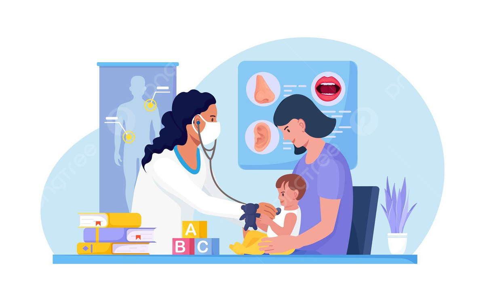

<p align="center">
  
</p>

<p align="center">
  <strong> Pediatric Clinic Management System.</strong>
</p>

<p align="center">
  Reducing procedures for clinics, supporting the improvement of medical examination and treatment quality in Vietnam
</p>

<p align="center">
  <a href="https://www.techsciresearch.com/report/vietnam-clinics-market/8179.html"><strong>Explore Vietnam Clinic Market »</strong></a>
</p>


## Table of Contents

1. [Installation](#installation)
2. [Project Motivation](#project-motivation)
3. [File Descriptions](#file-descriptions)
4. [Results](#results)
5. [Licensing, Authors, and Acknowledgements](#licensing-authors-and-acknowledgements)

## Installation 

### 1. Install Microsoft Visual Studio Code and Microsoft SQL Server

Download Microsoft Visual Studio: https://visualstudio.microsoft.com/
Dowload Microsoft SQL Server: https://www.microsoft.com/en-us/sql-server/sql-server-downloads

### 2. Clone the Repository

```bash
git clone https://github.com/KienTran2000/Pediatric_Clinic
```

### 3. Connect to the Database
Open Microsoft SQL Server Management Studio and connect to your database instance.

### 4. Run the App
Open the project folder in Visual Studio Code,check the connection string in the `web.config` file, and run the application.

## Project Motivation
### 1. Problem Statement
<div align="justify">

Our whole country is in the years of transformation with the 4.0 industrial
revolution with the core of information technology mentioned everywhere. The
application of information technology and technology in all areas of life brings
about a breakthrough in efficiency, benefits and is focused on investment more
than ever.
One of the most popular application areas of information technology as mentioned
above is the application of building management software in many jobs and fields
such as administrative agencies, schools, warehouse systems, retail stores, or
especially in the medical field, hospitals, clinics... The application of management
systems in parallel with the gradual elimination of traditional forms of management
and storage helps to significantly improve efficiency, minimizing cumbersome
procedures and processes.

</div>

### 2. Reason for Choosing the Topic
<div align="justify">

To consolidate knowledge after years of studying at school and initially apply
information technology in the field of management and software development, I chose the
topic "Building pediatric clinic management software - home examination subsystem
"as the content of the graduation project. With the desire to build a more improved, more
productive system to serve the management of pediatric patient information, manage the
payment of pediatric hospital fees and save pediatric patient medical records after...
becoming convenient, scientific and accurate, meeting the needs of relatives, pediatric
patients and system users.

</div>

### 3. Project Overview

<div align="justify">

The software includes two subsystems:
 - Clinic examination and treatment subsystem.
 - Home examination and treatment subsystem.
Besides, each subsystem includes applications and interfaces for different subjects: patients, doctors, and clinic staff.
</div>

### 4. Research Methodology
<div align="justify">

 Analytical method
- Refer to pediatric clinic management software systems that have
appeared on the market.
- Analyze needs, search for relevant information to build
features to serve real-world problems.
- Learn the technologies used.
• Observational synthesis method:
- Survey the operation of the pediatric clinic to have a visual view of
the actual business process.
• Practical method
- Test programming.

</div>

## File Descriptions
<div align="justify">
The project folder SME_DASHBOARD contains all source files, data, and assets needed to run the Vietnam SME ICT Dashboard. Below is an overview of each component:

- `Areas/` – Role-specific MVC modules (e.g. LeTan, BacSi)
- `Controllers/` – Application logic and routing
- `Models/` – Business data classes
- `Views/` – Razor-based UI for each role
- `Helpers/` – Shared utilities and logic
- `Rotativa/` – PDF generation engine
- `App_Start/` – Routing and bundle configuration
- `Scripts/Content/` – JavaScript, jQuery, CSS
</div>

## Result

### 1. Home page of the clinic

This will include information about doctors, information about medical examination services and information about medical examination and treatment facilities.

https://private-user-images.githubusercontent.com/77290046/475053968-5ee2cb76-255d-4e34-98ed-e122789e6528.mp4?jwt=eyJhbGciOiJIUzI1NiIsInR5cCI6IkpXVCJ9.eyJpc3MiOiJnaXRodWIuY29tIiwiYXVkIjoicmF3LmdpdGh1YnVzZXJjb250ZW50LmNvbSIsImtleSI6ImtleTUiLCJleHAiOjE3NTQ0OTE1MTcsIm5iZiI6MTc1NDQ5MTIxNywicGF0aCI6Ii83NzI5MDA0Ni80NzUwNTM5NjgtNWVlMmNiNzYtMjU1ZC00ZTM0LTk4ZWQtZTEyMjc4OWU2NTI4Lm1wND9YLUFtei1BbGdvcml0aG09QVdTNC1ITUFDLVNIQTI1NiZYLUFtei1DcmVkZW50aWFsPUFLSUFWQ09EWUxTQTUzUFFLNFpBJTJGMjAyNTA4MDYlMkZ1cy1lYXN0LTElMkZzMyUyRmF3czRfcmVxdWVzdCZYLUFtei1EYXRlPTIwMjUwODA2VDE0NDAxN1omWC1BbXotRXhwaXJlcz0zMDAmWC1BbXotU2lnbmF0dXJlPTIyZWUwZmIwYmU0NTViNzdiOWIxYTVjM2YzZmEzNTYwOTg5YmY0ZDI1ZDRlMWM2YmI3NmYzZGVlMjgyNDNhOTEmWC1BbXotU2lnbmVkSGVhZGVycz1ob3N0In0.dm-EoZ63LtCa30igGyGDf0QqWLQUvIb-8AShgsQ3Y6w

Customers can register an account and log in, follow information, comment on posts.

https://private-user-images.githubusercontent.com/77290046/475054548-9b357fba-e1a7-445f-ae6b-fac1f7284312.mp4?jwt=eyJhbGciOiJIUzI1NiIsInR5cCI6IkpXVCJ9.eyJpc3MiOiJnaXRodWIuY29tIiwiYXVkIjoicmF3LmdpdGh1YnVzZXJjb250ZW50LmNvbSIsImtleSI6ImtleTUiLCJleHAiOjE3NTQ0OTE1MTcsIm5iZiI6MTc1NDQ5MTIxNywicGF0aCI6Ii83NzI5MDA0Ni80NzUwNTQ1NDgtOWIzNTdmYmEtZTFhNy00NDVmLWFlNmItZmFjMWY3Mjg0MzEyLm1wND9YLUFtei1BbGdvcml0aG09QVdTNC1ITUFDLVNIQTI1NiZYLUFtei1DcmVkZW50aWFsPUFLSUFWQ09EWUxTQTUzUFFLNFpBJTJGMjAyNTA4MDYlMkZ1cy1lYXN0LTElMkZzMyUyRmF3czRfcmVxdWVzdCZYLUFtei1EYXRlPTIwMjUwODA2VDE0NDAxN1omWC1BbXotRXhwaXJlcz0zMDAmWC1BbXotU2lnbmF0dXJlPTczYzQyZTI5YzYzNzFiNjM4YWNlMjhjZjQ5NWQzYWZkYzBlYTA4M2ZiZDA0MmZiYTc0NGY2YTVmZWI2MjZlMzkmWC1BbXotU2lnbmVkSGVhZGVycz1ob3N0In0.IUvYgc0pRmC2-ddlRQUE5r6Aljt_UUPBHW7MAo2HkG8
### 2. Customers log in and make an appointment
Customers log in to view appointment information, examination history, medication bills and tests.

https://private-user-images.githubusercontent.com/77290046/475056169-e0f62bdd-9dbf-48f8-a29c-f690546f6a23.mp4?jwt=eyJhbGciOiJIUzI1NiIsInR5cCI6IkpXVCJ9.eyJpc3MiOiJnaXRodWIuY29tIiwiYXVkIjoicmF3LmdpdGh1YnVzZXJjb250ZW50LmNvbSIsImtleSI6ImtleTUiLCJleHAiOjE3NTQ0OTE1MTcsIm5iZiI6MTc1NDQ5MTIxNywicGF0aCI6Ii83NzI5MDA0Ni80NzUwNTYxNjktZTBmNjJiZGQtOWRiZi00OGY4LWEyOWMtZjY5MDU0NmY2YTIzLm1wND9YLUFtei1BbGdvcml0aG09QVdTNC1ITUFDLVNIQTI1NiZYLUFtei1DcmVkZW50aWFsPUFLSUFWQ09EWUxTQTUzUFFLNFpBJTJGMjAyNTA4MDYlMkZ1cy1lYXN0LTElMkZzMyUyRmF3czRfcmVxdWVzdCZYLUFtei1EYXRlPTIwMjUwODA2VDE0NDAxN1omWC1BbXotRXhwaXJlcz0zMDAmWC1BbXotU2lnbmF0dXJlPTdiZGYzYjU0YTVlNTVjY2QyOGEyODkxOWM5OWE1MmRhNjczNjI4NTdmOWZkYWM4OGFkY2YyYTljYjExM2U4MmEmWC1BbXotU2lnbmVkSGVhZGVycz1ob3N0In0.O6N_SBhkb0YKbm8dPVV5kqlQEa3sPtxXuNOu38MdmG4

Customers can make appointments, choose doctors and examination services.

https://private-user-images.githubusercontent.com/77290046/475061507-88f90dd4-21c6-4e97-a693-1277c02e27ec.mp4?jwt=eyJhbGciOiJIUzI1NiIsInR5cCI6IkpXVCJ9.eyJpc3MiOiJnaXRodWIuY29tIiwiYXVkIjoicmF3LmdpdGh1YnVzZXJjb250ZW50LmNvbSIsImtleSI6ImtleTUiLCJleHAiOjE3NTQ0OTE1MTcsIm5iZiI6MTc1NDQ5MTIxNywicGF0aCI6Ii83NzI5MDA0Ni80NzUwNjE1MDctODhmOTBkZDQtMjFjNi00ZTk3LWE2OTMtMTI3N2MwMmUyN2VjLm1wND9YLUFtei1BbGdvcml0aG09QVdTNC1ITUFDLVNIQTI1NiZYLUFtei1DcmVkZW50aWFsPUFLSUFWQ09EWUxTQTUzUFFLNFpBJTJGMjAyNTA4MDYlMkZ1cy1lYXN0LTElMkZzMyUyRmF3czRfcmVxdWVzdCZYLUFtei1EYXRlPTIwMjUwODA2VDE0NDAxN1omWC1BbXotRXhwaXJlcz0zMDAmWC1BbXotU2lnbmF0dXJlPTg5ZDE5MDBjODE3NGRhZjAzZmNjOGIyOGNjODRhNmVlYzNlMjE3NDJjN2FiYzUyZGRhZWU1YWM4MWYxMGNhNTEmWC1BbXotU2lnbmVkSGVhZGVycz1ob3N0In0.I8OGrsO4Y9yh24B2aAKffKjk-Okmu6tSxfvzZIGdGG8

### 3. Staff arrange examination schedule, arrange laboratory, Collect medical fees

https://private-user-images.githubusercontent.com/77290046/475061584-2545d6e2-65db-44b7-a78f-3312052eca58.mp4?jwt=eyJhbGciOiJIUzI1NiIsInR5cCI6IkpXVCJ9.eyJpc3MiOiJnaXRodWIuY29tIiwiYXVkIjoicmF3LmdpdGh1YnVzZXJjb250ZW50LmNvbSIsImtleSI6ImtleTUiLCJleHAiOjE3NTQ0OTE1MTcsIm5iZiI6MTc1NDQ5MTIxNywicGF0aCI6Ii83NzI5MDA0Ni80NzUwNjE1ODQtMjU0NWQ2ZTItNjVkYi00NGI3LWE3OGYtMzMxMjA1MmVjYTU4Lm1wND9YLUFtei1BbGdvcml0aG09QVdTNC1ITUFDLVNIQTI1NiZYLUFtei1DcmVkZW50aWFsPUFLSUFWQ09EWUxTQTUzUFFLNFpBJTJGMjAyNTA4MDYlMkZ1cy1lYXN0LTElMkZzMyUyRmF3czRfcmVxdWVzdCZYLUFtei1EYXRlPTIwMjUwODA2VDE0NDAxN1omWC1BbXotRXhwaXJlcz0zMDAmWC1BbXotU2lnbmF0dXJlPTU5MDU1MDQzYmJiZWZkZTgxYzdhZGM3NTIwODcyNzMwZGY5MjU0YjQ4NGQyNjMzZDc1NTgxOGQyMGFlNDU4OWEmWC1BbXotU2lnbmVkSGVhZGVycz1ob3N0In0.nhg9hSLkZGG4SKLR04STG5YcnBoGMS1vyFx2k-3c2-A

https://private-user-images.githubusercontent.com/77290046/475065807-59138a64-5723-4a10-ac0d-f506e5012015.mp4?jwt=eyJhbGciOiJIUzI1NiIsInR5cCI6IkpXVCJ9.eyJpc3MiOiJnaXRodWIuY29tIiwiYXVkIjoicmF3LmdpdGh1YnVzZXJjb250ZW50LmNvbSIsImtleSI6ImtleTUiLCJleHAiOjE3NTQ0OTE1MTcsIm5iZiI6MTc1NDQ5MTIxNywicGF0aCI6Ii83NzI5MDA0Ni80NzUwNjU4MDctNTkxMzhhNjQtNTcyMy00YTEwLWFjMGQtZjUwNmU1MDEyMDE1Lm1wND9YLUFtei1BbGdvcml0aG09QVdTNC1ITUFDLVNIQTI1NiZYLUFtei1DcmVkZW50aWFsPUFLSUFWQ09EWUxTQTUzUFFLNFpBJTJGMjAyNTA4MDYlMkZ1cy1lYXN0LTElMkZzMyUyRmF3czRfcmVxdWVzdCZYLUFtei1EYXRlPTIwMjUwODA2VDE0NDAxN1omWC1BbXotRXhwaXJlcz0zMDAmWC1BbXotU2lnbmF0dXJlPWZhYzMzNzc2NWRiNjk2NWNiM2M2MTQxM2VjZmM0NDU4NmM5ZTBmOTgyNWUyZGNjNzJmZTMzNmUxNzgzOTYxNzkmWC1BbXotU2lnbmVkSGVhZGVycz1ob3N0In0.VVRD569HlUWJFhose601ndmUB5iBEkMLxc4gut8-iOk

### 4. Doctors manage patient information

https://private-user-images.githubusercontent.com/77290046/475069388-a6f9c92a-a98c-4cc1-8037-2cedfcff49b9.mp4?jwt=eyJhbGciOiJIUzI1NiIsInR5cCI6IkpXVCJ9.eyJpc3MiOiJnaXRodWIuY29tIiwiYXVkIjoicmF3LmdpdGh1YnVzZXJjb250ZW50LmNvbSIsImtleSI6ImtleTUiLCJleHAiOjE3NTQ0OTE1MTcsIm5iZiI6MTc1NDQ5MTIxNywicGF0aCI6Ii83NzI5MDA0Ni80NzUwNjkzODgtYTZmOWM5MmEtYTk4Yy00Y2MxLTgwMzctMmNlZGZjZmY0OWI5Lm1wND9YLUFtei1BbGdvcml0aG09QVdTNC1ITUFDLVNIQTI1NiZYLUFtei1DcmVkZW50aWFsPUFLSUFWQ09EWUxTQTUzUFFLNFpBJTJGMjAyNTA4MDYlMkZ1cy1lYXN0LTElMkZzMyUyRmF3czRfcmVxdWVzdCZYLUFtei1EYXRlPTIwMjUwODA2VDE0NDAxN1omWC1BbXotRXhwaXJlcz0zMDAmWC1BbXotU2lnbmF0dXJlPThhYWM3ODY3MjgyZGFjZThkY2NiNzFjN2M1MjEyNTMyOTdjM2RiYmUxOThkMjBhNDEzNDgzZTFlYWFlMjQ0NTkmWC1BbXotU2lnbmVkSGVhZGVycz1ob3N0In0.XyDNcgJ3eBYyWcbuCauoD3DeILjVcoSZi8nI54dieto

## Licensing, Authors, and Acknowledgements
<div align="justify">

We would like to thank the following sources and tools that made this project possible:
<p align="justify">
  <a href="https://medicviet.vn/vn/dieu-duong.html">Prestigious and quality home nursing service in Hanoi </a>
</p>

<p align="justify">
  <a href="https://www.vietnammedicalpractice.com/hanoi/en/our-services/medical-services/pediatrics"> Vietnam Family Medical Practice System</a>
</p>


Special thanks to all reviewers and mentors who provided feedback during the dashboard development.

</div>


